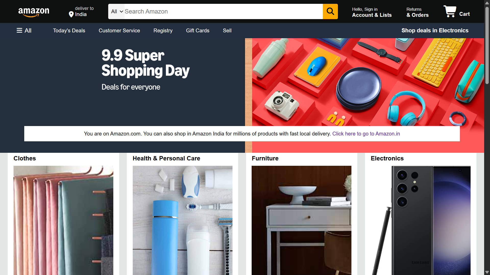

# 🛒 Amazon Front Page Clone  

This is a *static clone of Amazon’s front page, built using **HTML and CSS*.  
The project was created as part of my web development learning journey.  

🔗 *Live Demo*: [View Here](https://abhihari777.github.io/Amazon-front-page-clone/)  

---

## 📌 Features
- Amazon-like header and footer  
- Navigation bar with hover effects  
- Product section styled with CSS  
- “See More” button with hover animation  
- It's completely responsive Works on mobile, tablets and PC

---

## 📸 Screenshot
   

---

## 🛠️ Tech Stack
- *HTML5*  
- *CSS3*  

---

## ⚠️ Disclaimer
This project is a practice clone of Amazon’s front page built using only HTML & CSS.

It is not functional (links, search, cart, and language switch do not work).

Some layouts may appear broken on the first load due to browser rendering or caching issues, but refreshing the page usually fixes it.

The project is intended for learning and portfolio purposes only, not for commercial use.

---

